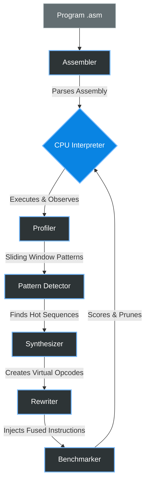

# Self-Evolving CPU Emulator 🧬


A Python-based CPU emulator whose instruction set **adapts to observed workload patterns**. The CPU profiles execution, discovers hot instruction sequences, synthesizes new virtual opcodes, benchmarks them, and keeps only the ones that provide real speedup.

## Quick Start

```bash
# Install dependencies (optional — works without them too)
pip install -r requirements.txt

# Run all demo programs through the evolution pipeline
python main.py demo

# Run a specific program
python main.py run programs/sum_array.asm

# Evolve a program (discover + benchmark new instructions)
python main.py evolve programs/stress_test.asm

# Full benchmark comparison (baseline vs evolved)
python main.py benchmark programs/matrix_ops.asm

# List the base instruction set
python main.py list-instructions
```

## Architecture



## How It Works

1. **Execute & Profile**: The CPU runs your program while a profiler records every instruction sequence using a sliding window
2. **Detect Patterns**: The pattern detector finds sequences that occur thousands of times (e.g., `ADD → ADD → STORE`)
3. **Synthesize Instructions**: For each hot pattern, a new virtual opcode is created that executes the entire sequence in one dispatch cycle
4. **Rewrite Program**: The original program is rewritten to use the new fused instructions
5. **Benchmark & Score**: The evolved program is benchmarked against the baseline. Instructions that provide real speedup are kept; the rest are pruned
6. **Repeat**: The process repeats for multiple generations

## Base Instruction Set

| Opcode | Syntax | Description |
|--------|--------|-------------|
| `LOAD` | `LOAD Rd, value` | Load immediate or memory into register |
| `STORE` | `STORE Rs, addr` | Store register to memory |
| `ADD` | `ADD Rd, Rs` | Rd = Rd + Rs |
| `SUB` | `SUB Rd, Rs` | Rd = Rd - Rs |
| `MUL` | `MUL Rd, Rs` | Rd = Rd × Rs |
| `DIV` | `DIV Rd, Rs` | Rd = Rd ÷ Rs (integer) |
| `MOV` | `MOV Rd, Rs` | Copy Rs to Rd |
| `INC` | `INC Rd` | Rd = Rd + 1 |
| `DEC` | `DEC Rd` | Rd = Rd - 1 |
| `CMP` | `CMP Ra, Rb` | Compare and set flags |
| `JUMP` | `JUMP label` | Unconditional jump |
| `JZ` | `JZ Rd, label` | Jump if Rd is zero |
| `JNZ` | `JNZ Rd, label` | Jump if Rd is not zero |
| `NOP` | `NOP` | No operation |
| `HALT` | `HALT` | Stop execution |

## Testing

```bash
python -m pytest tests/ -v
```

## Project Structure

```
self-evolving-cpu/
├── cpu.py                 # Core CPU emulator (registers, memory, dispatch)
├── assembler.py           # Assembly parser (labels, operands, comments)
├── profiler.py            # Execution profiler (sliding window patterns)
├── pattern_detector.py    # Hot pattern detection and ranking
├── synthesizer.py         # Virtual opcode synthesis
├── rewriter.py            # Program rewriting with fused instructions
├── benchmarker.py         # Performance measurement and scoring
├── evolution.py           # Evolution orchestrator (multi-generation)
├── dashboard.py           # Terminal display (rich / plain text)
├── main.py                # CLI entry point
├── requirements.txt
├── programs/
│   ├── sum_array.asm      # Array summation benchmark
│   ├── matrix_ops.asm     # Matrix multiply-add operations
│   ├── fibonacci.asm      # Fibonacci sequence
│   └── stress_test.asm    # Maximum fusion opportunities
└── tests/
    ├── test_cpu.py
    ├── test_assembler.py
    ├── test_profiler.py
    ├── test_synthesizer.py
    └── test_evolution.py
```
